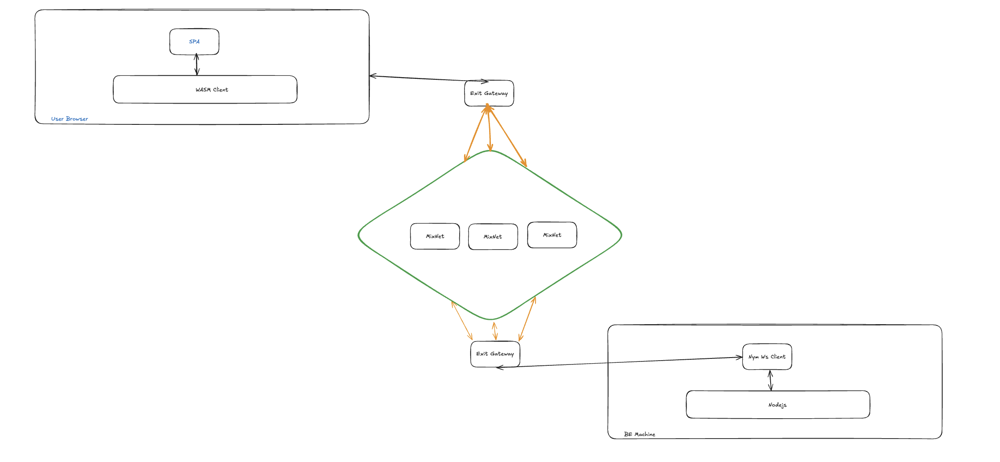

# My Project



## Overview

This project demonstrates how to use the Nym client to create a secure and private communication channel. The Nym client is initialized using the Nym binary from the releases, and a Nym client is set up following the instructions provided in the [Nym WebSocket Client documentation](https://nymtech.net/developers/clients/websocket-client.html).

## Running the Application

To run this application, follow these steps:

1. **Download the Nym Binary**: Download the Nym binary from the releases page.
2. **Initialize the Nym Client**: Follow the instructions in the [Nym WebSocket Client documentation](https://nymtech.net/developers/clients/websocket-client.html) to initialize the Nym client.
3. **Run the Nym Client**: Start the Nym client on your local machine.
   
```sh
./nym-client init --id your-client-id
./nym-client run --id your-client-id
```
4. **Run the Backend Server**:
   - This application listens to the `nym-client` that you ran earlier. It connects using the WebSocket URL `ws://127.0.0.1:1977`, which is the default for `nym-client`. Please ensure you save the `client address` from the output as it will be needed later.
   - To run the backend, navigate to the `jsbe` folder. It requires a NodeJS environment. If you don't have NodeJS installed, you can download it [here](https://nodejs.org/en/download/package-manager).
   - If your environment is already set up, open the terminal, navigate to the `jsbe` folder, and run the following commands:
     ```bash
     yarn && yarn run dev
     ```
     The application will start and begin listening for WebSocket events from `nym-client`.

5. **Run the Frontend Application**:
   - Navigate to the `fe` folder in your terminal and run the following commands:
     ```bash
     yarn && yarn run dev
     ```
   - After the application starts, open the URL displayed in the terminal output.
   - In the codebase, go to the `App.tsx` file and find the `recipentAddress` variable at the top of the file. Replace its value with your `client address` from the earlier output.
   - Once updated, start the connection in the frontend application and check the browser console for any errors.
   - Finally, send a message through the frontend. You should see the output in the NodeJS process console.


## Disclaimer

**Please do not use the Java instance yet as it is not ready. Use the `jsbe` file for now.**

## Example Commands

### Starting the Nym Client

```sh
./nym-client init --id your-client-id
./nym-client run --id your-client-id
```
